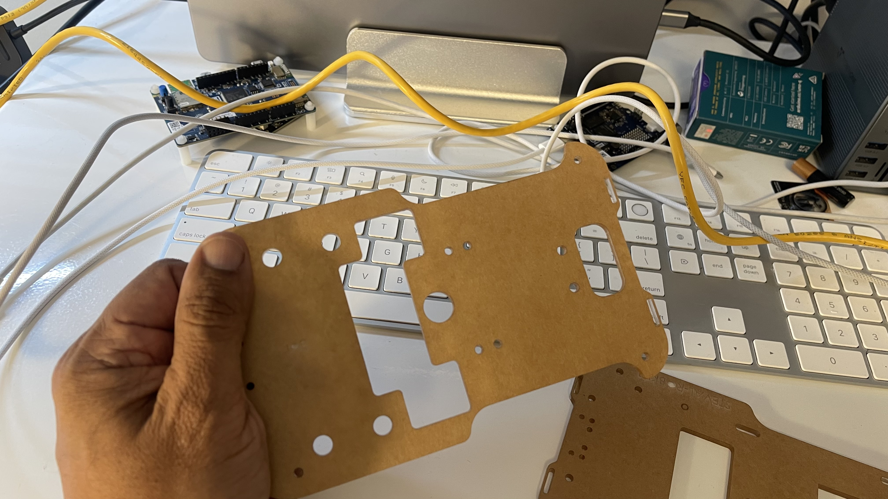
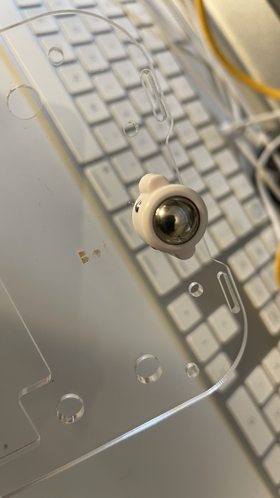
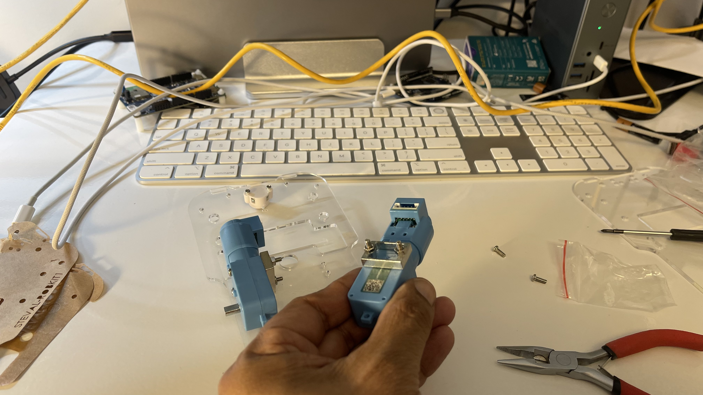
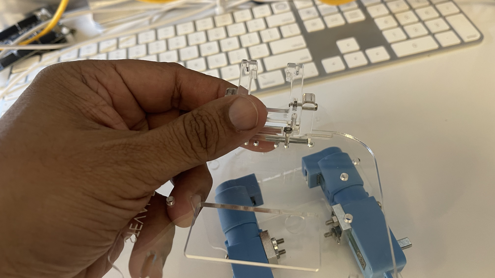
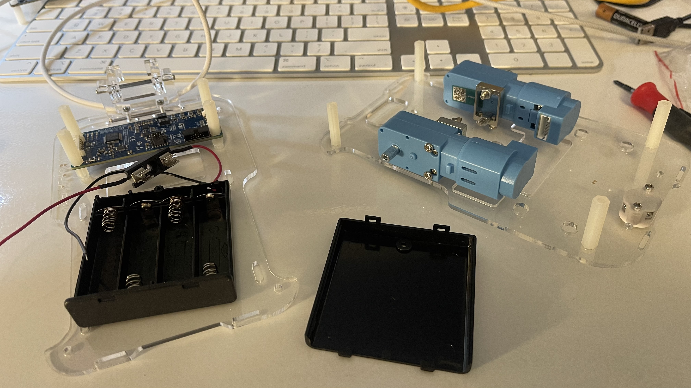
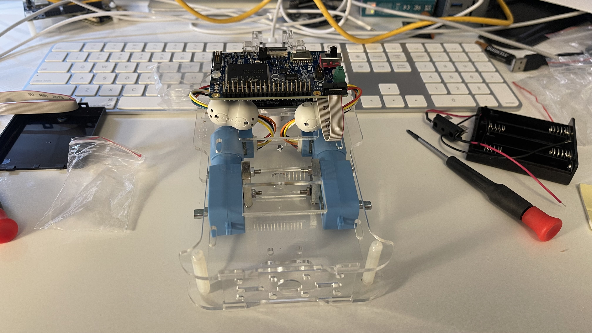
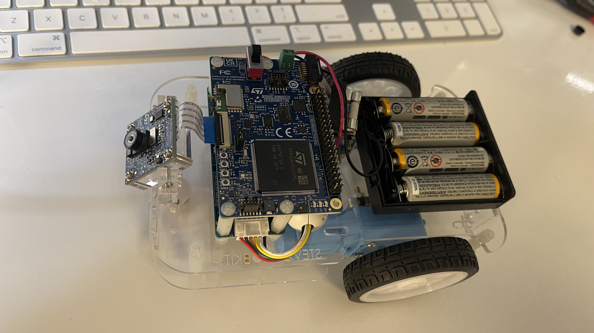
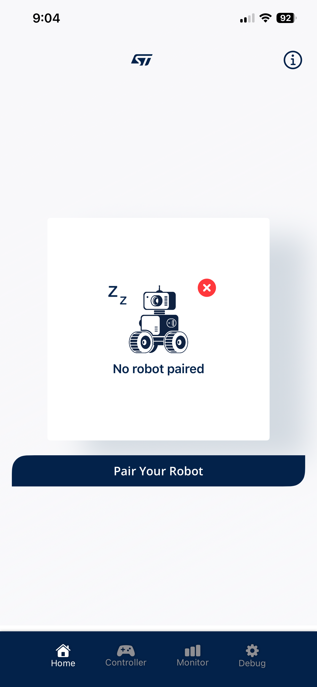
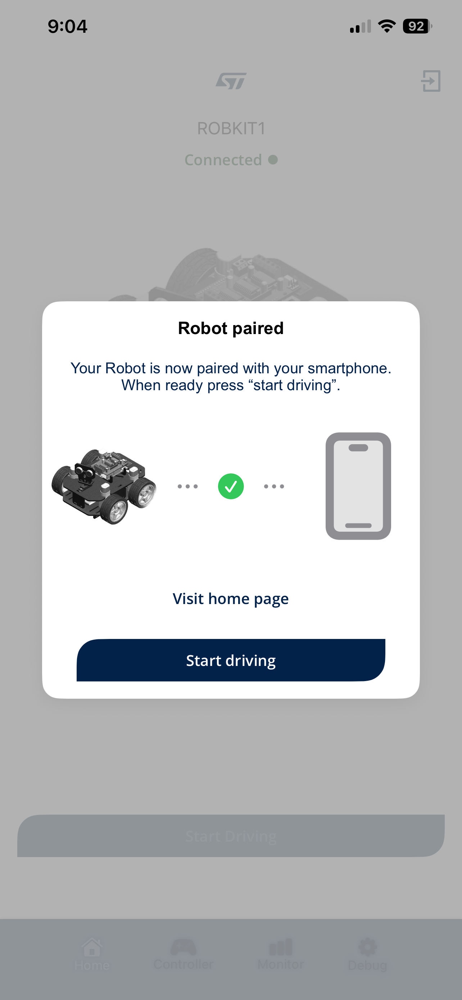

# Robot - Mini Rover Vehicle

### SoM
The System on a Module has a STM32H725 MCU.  The motor boa
rd
is based on a STM32G071 microcontroller which is dedicated for motor control
and actuation and uses motor drivers to regulate the speed and direction
of the robot's movements.
### Vehicle
A Time-of-Flight (ToF) sensor and camera are attached to the board to allow
it to perceive and interact with its surroundings.

An Inertial Measurement Unit (IMU) and magnetometer enriches the board's 
capabilities by providing precise orientation and motion sensing to help
it navigate.

A dedicated firmware allows the robot to move autonomously and is used to run
different AI algorithms.

The front wheel is attached:

[robot-assembly-12-startingup.MOV](.artifacts/src/mov/robot-assembly-12-startingup.MOV)

[robot-assembly-20-driving.MOV](.artifacts/src/mov/robot-assembly-20-driving.MOV)
